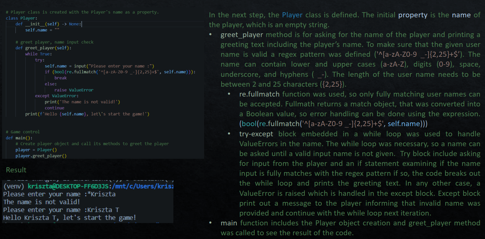
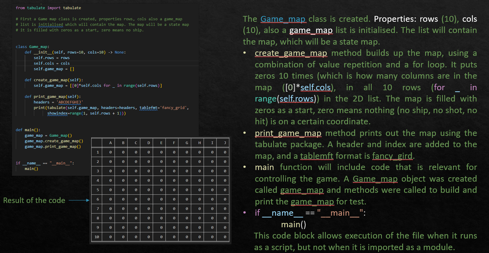

<!-- 
R1	Answers to all the documentation requirements below.
R2	Your README.md should have a separate heading for each documentation requirement and answers organised under the appropriate headings.
R3	Provide full attribution to referenced sources (where applicable).
R4	Provide a link to your source control repository
R5	
Identify any code style guide or styling conventions that the application will adhere to.

Reference the chosen style guide appropriately.

R6	Develop a list of features that will be included in the application. It must include:
- at least THREE features
- describe each feature

Note: Ensure that your features above allow you to demonstrate your understanding of the following language elements and concepts:
- use of variables and the concept of variable scope
- loops and conditional control structures
- error handling

Consult with your educator to check your features are sufficient .
R7	
Develop an implementation plan which:
- outlines how each feature will be implemented and a checklist of tasks for each feature
- prioritise the implementation of different features, or checklist items within a feature
- provide a deadline, duration or other time indicator for each feature or checklist/checklist-item

Utilise a suitable project management platform to track this implementation plan.

Provide screenshots/images and/or a reference to an accessible project management platform used to track this implementation plan. 

> Your checklists for each feature should have at least 5 items.

R8	
Design help documentation which includes a set of instructions which accurately describe how to use and install the application.

You must include:
- steps to install the application
- any dependencies required by the application to operate
- any system/hardware requirements
- how to use any command line arguments made for the application -->
# Battleship Lite

Battleship Lite is a solo game, played on a 10 * 10 map (grid), each grid square is identified with a letter and a number. The application automatically arranges the ships either vertically or horizontally on the map. Five ships are placed on the game board, their type determines how many grid squares they take up:

* Carrier (5)
* Battleship (4)
* Cruiser (3)
* Submarine (3)
* Destroyer (2)

It is important to note that the ships can not overlap and they are hidden from the Player.
After the map is built and ships are arranged on the map, the Player can start the discovery of the ships by shooting to a target. The application provides feedback (graphically on the map and via textual information below the map) about the result of the shot (i.e.: hit or miss or sinking ship). The game continues until all of the ships were discovered or the Player types exit.

# Source control repository

[Battleship Lite Github Repository](https://github.com/KrisztaT/Battleship)

# Style Convention

**PEP 8** was utilised as a style convention during the development of the terminal application. I enabled linting in VSC and installed the pycodestyle (pep8) extension to aid me.

# Features

## Greeting player

When the player starts the game, the player name is asked and checked for validity. After a valid user name is given the player is greeted by the application.

## Game Map creation

To start the game a game map needs to be created, first an empty map is built up with zeros and later ships will be added to the map. Zeros indicate that is nothing on the map at that coordinate.

# Implementation plan

[Trello Board](https://trello.com/b/aTdTEYkF/battleship-lite)

# Help documentation
