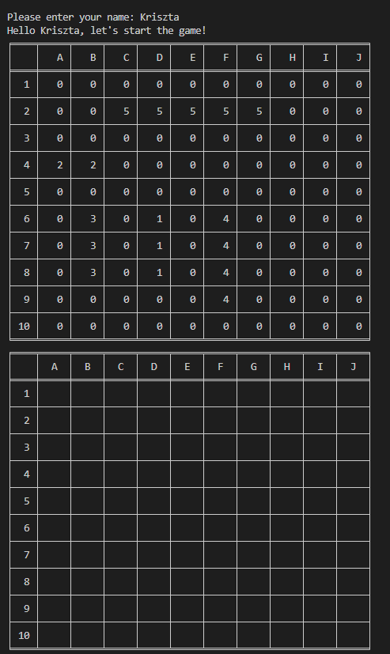
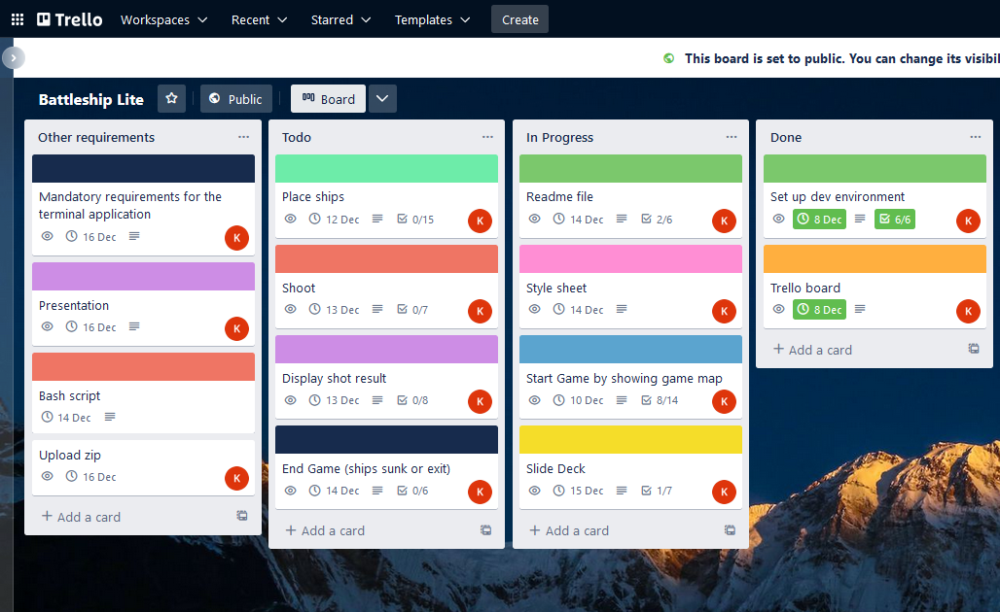
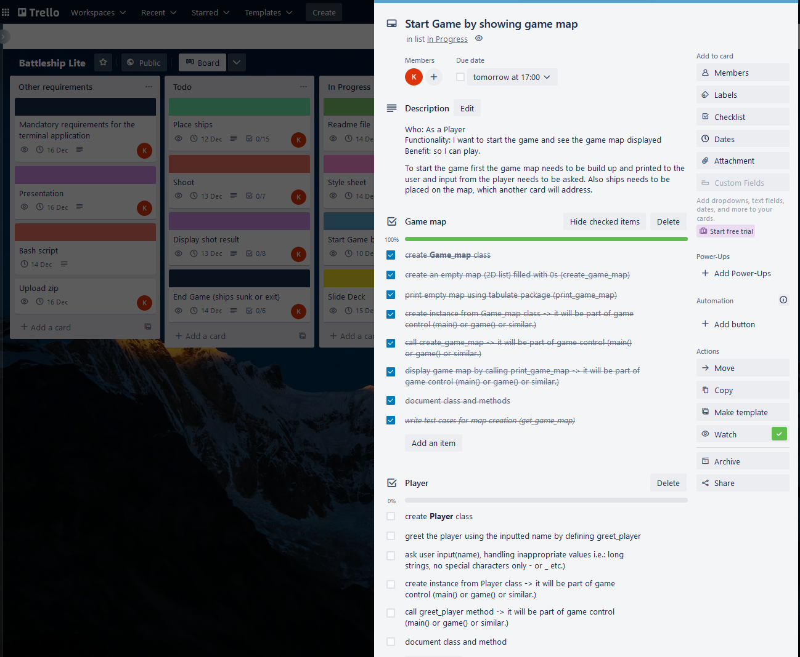
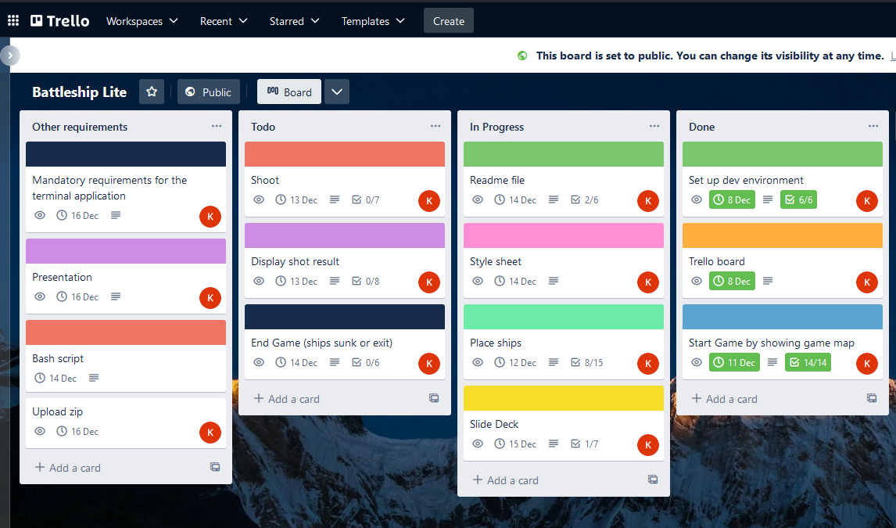
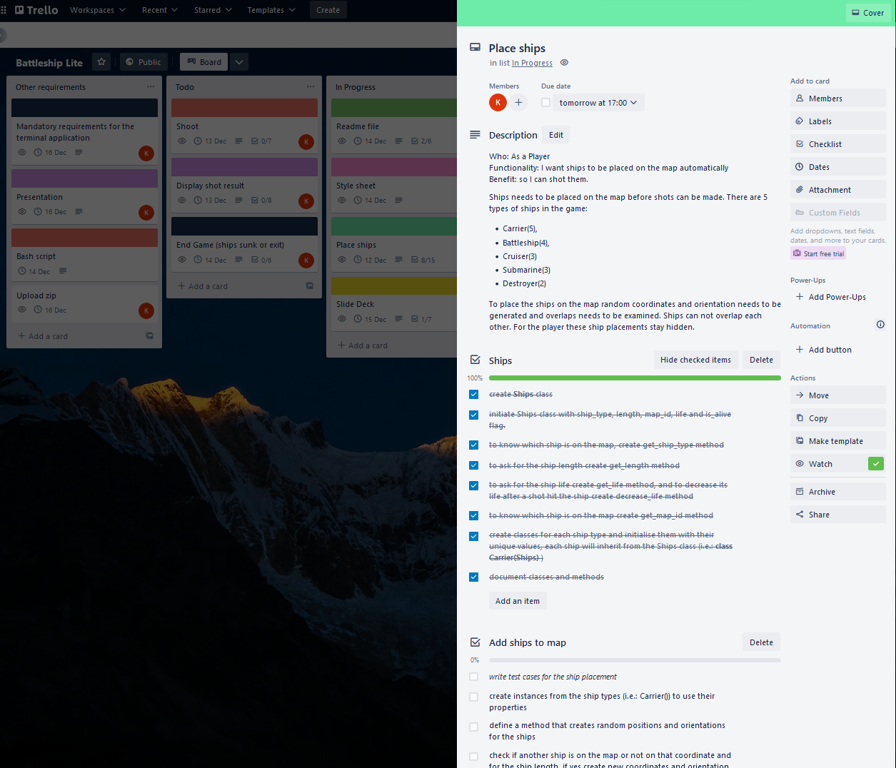
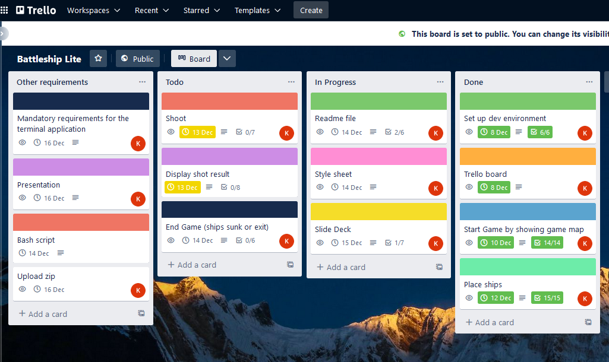
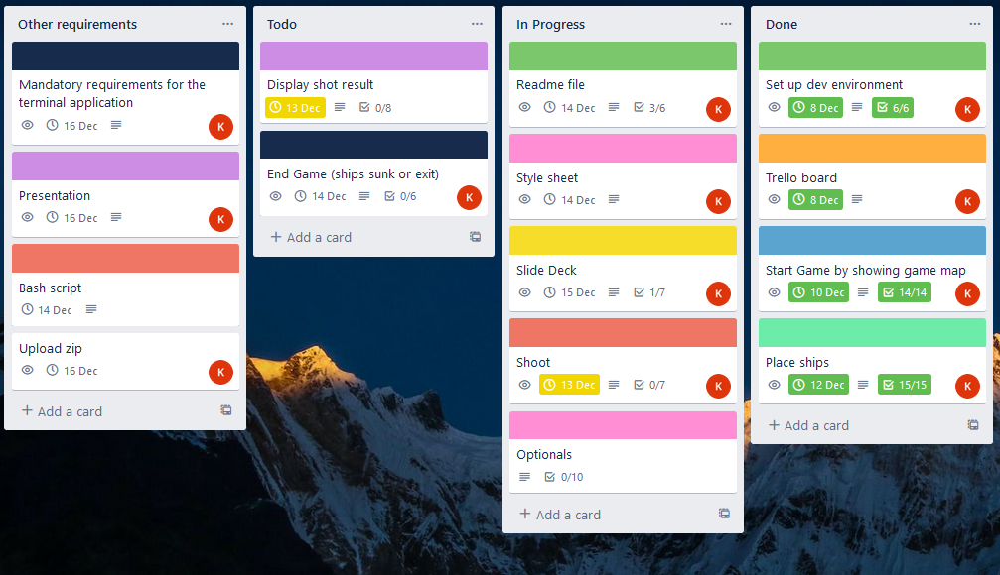
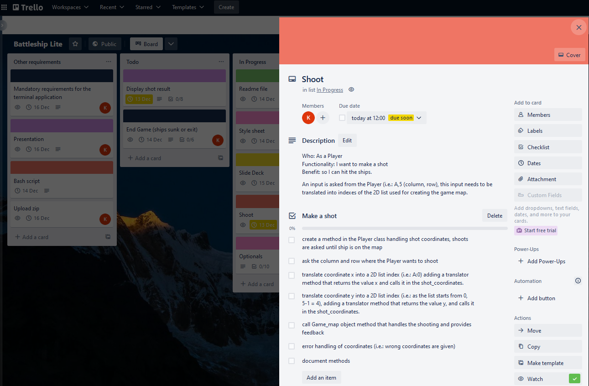

<!-- 
R1	Answers to all the documentation requirements below.
R2	Your README.md should have a separate heading for each documentation requirement and answers organised under the appropriate headings.
R3	Provide full attribution to referenced sources (where applicable).
R4	Provide a link to your source control repository
R5	
Identify any code style guide or styling conventions that the application will adhere to.

Reference the chosen style guide appropriately.

R6	Develop a list of features that will be included in the application. It must include:
- at least THREE features
- describe each feature

Note: Ensure that your features above allow you to demonstrate your understanding of the following language elements and concepts:
- use of variables and the concept of variable scope
- loops and conditional control structures
- error handling

Consult with your educator to check your features are sufficient .
R7	
Develop an implementation plan which:
- outlines how each feature will be implemented and a checklist of tasks for each feature
- prioritise the implementation of different features, or checklist items within a feature
- provide a deadline, duration or other time indicator for each feature or checklist/checklist-item

Utilise a suitable project management platform to track this implementation plan.

Provide screenshots/images and/or a reference to an accessible project management platform used to track this implementation plan. 

> Your checklists for each feature should have at least 5 items.

R8	
Design help documentation which includes a set of instructions which accurately describe how to use and install the application.

You must include:
- steps to install the application
- any dependencies required by the application to operate
- any system/hardware requirements
- how to use any command line arguments made for the application -->
# Battleship Lite

Battleship Lite is a solo game, played on a 10 * 10 map (grid), each grid square is identified with a letter and a number. The application automatically arranges the ships either vertically or horizontally on the map. Five ships are placed on the game board, their type determines how many grid squares they take up:

* Carrier (5)
* Battleship (4)
* Cruiser (3)
* Submarine (3)
* Destroyer (2)

It is important to note that the ships can not overlap, can not hang off the map and they are hidden from the Player.
After the map is built and ships are arranged on the map, the Player can start the discovery of the ships by shooting to a target. The application provides feedback (graphically on the map and via textual information below the map) about the result of the shot (i.e.: hit or miss or sinking ship). The game continues until all of the ships were discovered or the Player types exit.

# Source control repository

[Battleship Lite Github Repository](https://github.com/KrisztaT/Battleship)

# Style Convention

**PEP 8** was utilised as a style convention during the development of the terminal application. I enabled linting in VSC and installed the pycodestyle (pep8) extension to aid me.

# Features

## Greeting player

When the player starts the game, the player name is asked and checked for validity (the name can contain lower and upper cases, numbers, space, underscore, hyphen and it needs to be between 2 and 25 character long). After a valid user name is given the player is greeted by the application. And the program prints out the map.

## Game Map creation and printing

Map is created for the player to start the game, which first is and empty map, only filled with zeros. There are two printing services included in the game, one for the time of the development (print_game_map()) and one for the player (print_user_game_map()). The dev print method prints the map showing where the ships can be found, so during the development of the game ships placement and shot results can be tracked visually. Once the development stage is finished that print method is not used anymore. Only the second map printing method will be called, that hides the ships place from the player, however it shows all the shot results.

## Ship placement

The application automatically places the ships on the map, this process can not be observed by the player because it is hidden. There are two main rules of the ship placement that the application must follow:

* ships can not overlap
* ships can not hang off the map

To place the ships on the map first coordinates and orientation is randomly generated. To follow the rules, these coordinates are examined based on the orientation to see if other ship is placed on the coordinate and the whole ship length or not and if the ship would hang off the map starting from the given coordinate. If other ship is placed or the ship would hang off using the generated coordinate, a new coordinate generation will take place and the examination starts from scratch. In case no other ship is on the ship length and wouldn't go out of the boundaries of the map, ship is placed on the map.

Now let's see how these three features work together:

* the first textual section shows a successful greeting after entering the name.
* the first table shows the map print for development. 0 means there is nothing on the map, numbers from 1 to 5 represents the different types of ships. Using this method we can make sure if the ship placement was successful graphically. (There are automated tests written to test this feature as well.)
* the second table is for the player, that is what is printed out at the start of the game



# Implementation plan

[Trello Board](https://trello.com/b/aTdTEYkF/battleship-lite)

Trello Board initial setup of the cards, as the development progresses the cards will be updated.


The first day of the development environment and trello board setup was done, and readme file, slide deck writing and style sheet use all in progress tasks for the project lifecycle. I started to develop the game map, hence it is in the progress column.



The game map card defines in the description the user story and additional information.

```
Who: As a Player
Functionality: I want to start the game and see the game map displayed
Benefit: so I can play.

To start the game first the game map needs to be build up and printed to the user and input from the player needs to be asked. Also ships needs to be placed on the map, which another card will address.
```
The checklist contains all the steps necessary to ask for user name, print a greetings out and build a map which is printed out.



Trello Board on 11/12/2022, showing that the Start Game card was finished and the Place ships card was ongoing.



The place ships card defines in the description the user story and additional information.

```
Who: As a Player
Functionality: I want ships to be placed on the map automatically
Benefit: so I can shot them.

Ships needs to be placed on the map before shots can be made. There are 5 types of ships in the game:

* Carrier(5),

* Battleship(4),

* Cruiser(3)

* Submarine(3)

* Destroyer(2)

To place the ships on the map random coordinates and orientation needs to be generated and overlaps needs to be examined. Ships can not overlap each other. For the player these ship placements stay hidden.
```
The checklist contains all the steps necessary to create ships classes, and add ships objects to the map following the above discussed rules.



Trello Board on 12/12/2022, showing that the Place ships card was done.



Trello Board on 13/12/2022, showing that the Shoot card was placed on the ongoing column card was done.



The shoot card defines in the description the user story and additional information.

```
Who: As a Player
Functionality: I want to make a shot
Benefit: so I can hit the ships.

An input is asked from the Player (i.e.: A,5 (column, row), this input needs to be translated into indexes of the 2D list used for creating the game map. 
```
The checklist contains all the steps necessary to ask for coordinates from the player, if coordinates are not valid handle errors and to translate valid coordinates to the language that the 2D list (game map) understands.



# Help documentation
